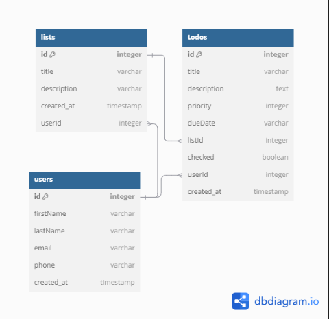

 # Todo List
 
 ## Schema
 
  

 ## Routes

 ## API Documentation

## USER AUTHENTICATION/AUTHORIZATION

### All endpoints that require authentication

All endpoints that require a current user to be logged in.

* Request: endpoints that require authentication
* Error Response: Require authentication
  * Status Code: 401
  * Headers:
    * Content-Type: application/json
  * Body:

    ```json
    {
      "message": "Authentication required"
    }
    ```

### All endpoints that require proper authorization

All endpoints that require authentication and the current user does not have the
correct role(s) or permission(s).

* Request: endpoints that require proper authorization
* Error Response: Require proper authorization
  * Status Code: 403
  * Headers:
    * Content-Type: application/json
  * Body:

    ```json
    {
      "message": "Forbidden"
    }
    ```

### Get the Current User

Returns the information about the current user that is logged in.

* Require Authentication: false
* Request
  * Method: GET
  * URL: /api/profile
  * Body: false

* Successful Response when there is a logged in user
  * Status Code: 200
  * Headers:
    * Content-Type: application/json
  * Body:

    ```json
    {
      "user": {
        "id": 1,
        "firstName": "John",
        "lastName": "Smith",
        "email": "john.smith@gmail.com",
        "username": "JohnSmith"
      }
    }
    ```

* Successful Response when there is no logged in user
  * Status Code: 200
  * Headers:
    * Content-Type: application/json
  * Body:

    ```json
    {
      "user": null
    }
    ```

### Log In a User

Logs in a current user with valid credentials and returns the current user's
information.

* Require Authentication: false
* Request
  * Method: POST
  * URL: /api/profile
  * Headers:
    * Content-Type: application/json
  * Body:

    ```json
    {
      "credential": "john.smith@gmail.com",
      "password": "secret password"
    }
    ```

* Successful Response
  * Status Code: 200
  * Headers:
    * Content-Type: application/json
  * Body:

    ```json
    {
      "user": {
        "id": 1,
        "firstName": "John",
        "lastName": "Smith",
        "email": "john.smith@gmail.com",
        "username": "JohnSmith"
      }
    }
    ```

* Error Response: Invalid credentials
  * Status Code: 401
  * Headers:
    * Content-Type: application/json
  * Body:

    ```json
    {
      "message": "Invalid credentials"
    }
    ```

* Error response: Body validation errors
  * Status Code: 400
  * Headers:
    * Content-Type: application/json
  * Body:

    ```json
    {
      "message": "Bad Request", // (or "Validation error" if generated by Sequelize),
      "errors": {
        "credential": "Email or username is required",
        "password": "Password is required"
      }
    }
    ```

### Sign Up a User

Creates a new user, logs them in as the current user, and returns the current
user's information.

* Require Authentication: false
* Request
  * Method: POST
  * URL: /api/users/
  * Headers:
    * Content-Type: application/json
  * Body:

    ```json
    {
      "firstName": "John",
      "lastName": "Smith",
      "email": "john.smith@gmail.com",
      "username": "JohnSmith",
      "password": "secret password"
    }
    ```

* Successful Response
  * Status Code: 200
  * Headers:
    * Content-Type: application/json
  * Body:

    ```json
    {
      "user": {
        "id": 1,
        "firstName": "John",
        "lastName": "Smith",
        "email": "john.smith@gmail.com",
        "username": "JohnSmith"
      }
    }
    ```

* Error response: User already exists with the specified email
  * Status Code: 500
  * Headers:
    * Content-Type: application/json
  * Body:

    ```json
    {
      "message": "User already exists",
      "errors": {
        "email": "User with that email already exists"
      }
    }
    ```

* Error response: User already exists with the specified username
  * Status Code: 500
  * Headers:
    * Content-Type: application/json
  * Body:

    ```json
    {
      "message": "User already exists",
      "errors": {
        "username": "User with that username already exists"
      }
    }
    ```

* Error response: Body validation errors
  * Status Code: 400
  * Headers:
    * Content-Type: application/json
  * Body:

    ```json
    {
      "message": "Bad Request", // (or "Validation error" if generated by Sequelize),
      "errors": {
        "email": "Invalid email",
        "username": "Username is required",
        "firstName": "First Name is required",
        "lastName": "Last Name is required"
      }
    }
    ```

 ### Lists
 #### Get all a user's lists

Returns all the lists owned (created) by the current user.

* Require Authentication: true
* Request
  * Method: GET
  * URL: /api/lists/current
  * Body: false

* Successful Response
  * Status Code: 200
  * Headers:
    * Content-Type: application/json
  * Body:

    ```json
    {
      "Lists": [
        {
          "id": 1,
          "ownerId": 1,
          "title": "My List",
          "description": "This is my first list!",
          "createdAt": "2021-11-19 20:39:36",
          "updatedAt": "2021-11-19 20:39:36",
          
        }
      ]
    }
    ```
 #### Add a List

Creates and returns a new list.

* Require Authentication: true
* Request
  * Method: POST
  * URL: api/lists/
  * Headers:
    * Content-Type: application/json
  * Body:

    ```json
    {
      "title": "My Second List",
      "description": "This is my second list!",
    }
    ```

* Successful Response
  * Status Code: 201
  * Headers:
    * Content-Type: application/json
  * Body:

    ```json
    {
      "id": 1,
      "ownerId": 1,
      "title": "My Second List",
      "description": "This is my second List! :)",
      "createdAt": "2021-11-19 20:39:36",
      "updatedAt": "2021-11-19 20:39:36"
    }
    ```

* Error Response: Body validation errors
  * Status Code: 400
  * Headers:
    * Content-Type: application/json
  * Body:

    ```json
    {
      "message": "Bad Request", // (or "Validation error" if generated by Sequelize),
      "errors": {
        "title": "Title is required",
        "description": "Description is required",
      }
    }
    ```

 #### Update a list


Updates and returns an existing list.

* Require Authentication: true
* Require proper authorization: List must belong to the current user
* Request
  * Method: PUT
  * URL: apis/lists/:listId
  * Headers:
    * Content-Type: application/json
  * Body:

    ```json
    {
      "title": "App Academy",
      "description": "Place where web developers are created",
    }
    ```

* Successful Response
  * Status Code: 200
  * Headers:
    * Content-Type: application/json
  * Body:

    ```json
    {
      "id": 1,
      "ownerId": 1,
      "title": "App Academy",
      "description": "Place where web developers are created",
    }
    ```

* Error Response: Body validation errors
  * Status Code: 400
  * Headers:
    * Content-Type: application/json
  * Body:

    ```json
    {
      "message": "Bad Request", // (or "Validation error" if generated by Sequelize),
      "errors": {
        "title": "Name must be less than 50 characters",
        "description": "Description is required",
      }
    }
    ```

* Error response: Couldn't find a list with the specified id
  * Status Code: 404
  * Headers:
    * Content-Type: application/json
  * Body:

    ```json
    {
      "message": "List couldn't be found"
    }
    ```

 #### Delete a list
Deletes an existing list.

* Require Authentication: true
* Require proper authorization: List must belong to the current user
* Request
  * Method: DELETE
  * URL: lists/:listId
  * Body: none

* Successful Response
  * Status Code: 200
  * Headers:
    * Content-Type: application/json
  * Body:

    ```json
    {
      "message": "Successfully deleted"
    }
    ```

* Error response: Couldn't find a List with the specified id
  * Status Code: 404
  * Headers:
    * Content-Type: application/json
  * Body:

    ```json
    {
      "message": "List couldn't be found"
    }
    ```


 ### Todos
 
 #### View list todos

Returns all the todos that belong to a list specified by id.

* Require Authentication: false
* Request
  * Method: GET
  * URL: lists/:listId/todos
  * Body: none

* Successful Response
  * Status Code: 200
  * Headers:
    * Content-Type: application/json
  * Body:

    ```json
    {
      "Todos": [
        {
          "id": 1,
          "userId": 1,
          "listId": 1,
          "priority": 1,
          "title": "Visit this spot!",
          "description": "This is an awesome spot!",
          "checked": false,
          "dueDate": "February 10 2025, 11:59PM",
          "createdAt": "2021-11-19 20:39:36",
          "updatedAt": "2021-11-19 20:39:36" ,
          "User": {
            "id": 1,
            "firstName": "John",
            "lastName": "Smith"
          },
         
        }
      ]
    }
    ```

* Error response: Couldn't find a list with the specified id
  * Status Code: 404
  * Headers:
    * Content-Type: application/json
  * Body:

    ```json
    {
      "message": "List couldn't be found"
    }
    ```


#### Create a Todo for a List based on the List's id

Create and return a new review for a spot specified by id.

* Require Authentication: true
* Request
  * Method: 
  * URL: /lists/:listId/todos
  * Headers:
    * Content-Type: application/json
  * Body:

    ```json
    {
      "priority": 1,
      "title": "Visit This Spot!",
      "description": "This was an awesome spot!",
      "dueDate": "2/11/25 11:59PM"
    }
    ```

* Successful Response
  * Status Code: 201
  * Headers:
    * Content-Type: application/json
  * Body:

    ```json
    {
      "id": 1,
      "userId": 1,
      "listId": 1,
      "title": "Visit this spot!",
      "description": "This was an awesome spot!",
      "dueDate": "February 11 2025, 11:59PM",
      "priority": 1,
      "checked": false,
      "createdAt": "2021-11-19 20:39:36",
      "updatedAt": "2021-11-19 20:39:36"
    }
    ```

* Error Response: Body validation errors
  * Status Code: 400
  * Headers:
    * Content-Type: application/json
  * Body:

    ```json
    {
      "message": "Bad Request", // (or "Validation error" if generated by Sequelize),
      "errors": {
        "title": "text is required",
        "description": "text is required",
        "priority": "Integer is required",
        "dueDate": "Date is required",
      }
    }
    ```

* Error response: Couldn't find a List with the specified id
  * Status Code: 404
  * Headers:
    * Content-Type: application/json
  * Body:

    ```json
    {
      "message": "List couldn't be found"
    }
    ```


 #### Update lists todo


Update and return an existing todo.

* Require Authentication: true
* Require proper authorization: Todo must belong to the current user
* Request
  * Method: PUT
  * URL: /api/todos/:todoId
  * Headers:
    * Content-Type: application/json
  * Body:

    ```json
    {
      "priority": 1,
      "title": "Visit This Spot!",
      "description": "This was an awesome spot!",
      "dueDate": "2/11/25 11:59PM"
    }
    ```

* Successful Response
  * Status Code: 200
  * Headers:
    * Content-Type: application/json
  * Body:

    ```json
    {
      "id": 1,
      "userId": 1,
      "listId": 1,
      "title": "Visit this spot!",
      "description": "This was an awesome spot!",
      "priority": 1,
      "createdAt": "2021-11-19 20:39:36",
      "updatedAt": "2021-11-20 10:06:40"
    }
    ```

* Error Response: Body validation errors
  * Status Code: 400
  * Headers:
    * Content-Type: application/json
  * Body:

    ```json
    {
      "message": "Bad Request", // (or "Validation error" if generated by Sequelize),
      "errors": {
        "title": "text is required",
        "description": "description text is required",
        "priority": "Integer is required",
        "dueDate": "Date is required"
      }
    }
    ```

* Error response: Couldn't find a todo with the specified id
  * Status Code: 404
  * Headers:
    * Content-Type: application/json
  * Body:

    ```json
    {
      "message": "Todo couldn't be found"
    }
    ```

 #### Delete a Todo

Delete an existing review.

* Require Authentication: true
* Require proper authorization: Tdo must belong to the current user
* Request
  * Method: DELETE
  * URL: /api/todos/:todoId
  * Body: none

* Successful Response
  * Status Code: 200
  * Headers:
    * Content-Type: application/json
  * Body:

    ```json
    {
      "message": "Successfully deleted"
    }
    ```

* Error response: Couldn't find a Todo with the specified id
  * Status Code: 404
  * Headers:
    * Content-Type: application/json
  * Body:

    ```json
    {
      "message": "Todo couldn't be found"
    }
    ```